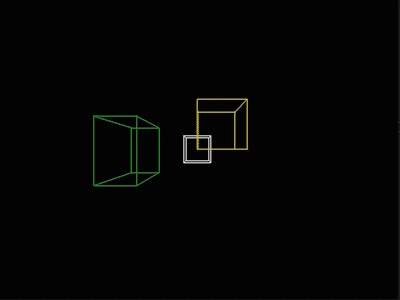
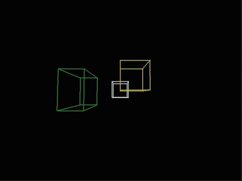

# GeometricModelling
Lecture tutorial about geometric modelling. Includes Quaternion rotations, interpolation, bezier curves and b-splines.

## 1. Quaternions
Given a world and view coordinate system, quaternion based transformations are implemented. These include translation of the view coordinate system in drection of the axis of the world coordinate system, rotation of the view coordinate system  the x,y,z-axis of the world coordinate system and rotation of the view system around the x,y,z-axis of the view coordinate system.

### Translation:

 
  

### Rotating the view around world axis

  
  
  

The bottom left corner of the cube is set to be the origin. The edge to the right, up and inward direction represent the world axis. This is nicely shown by the fact, that rotating around a world axis leaves the corresponding edge unaltered.

### Rotating the view around world axis with translated view system
Note that after initialization the world and view coordinate system coincide, which is why the first rotation around world or view look the same. In the following video captures of the view around world system, the view system is translated equally in x,y,z world direction. Here, the origin can still be tracked by the lower left corner of the yellow cube, as the view system is moved and not the world (where the cubes are defined).

  
  
  

### Rotating the view around view axis with translated view system
The difference gets clear when the systems dont't coincide. Again the view system is translated equally in x,y,z world direction for comparison.

## 2. Bezier Curves

## 3. B-Splines
